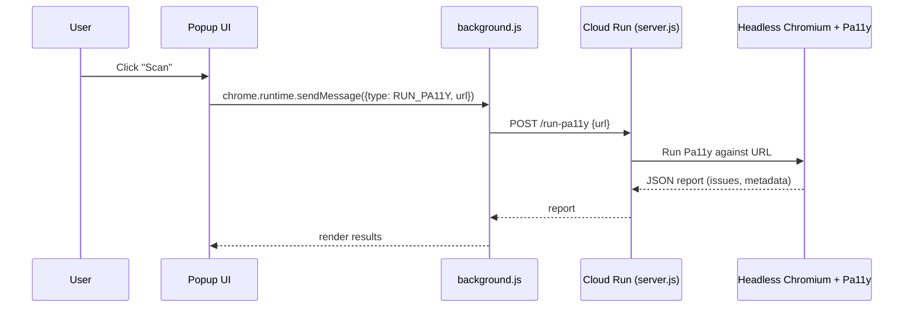

# A11y-Ally

## Introduction

**A11y-Ally** is an open-source browser extension designed to make web accessibility checks more practical and actionable during development.

Instead of treating accessibility as a one-time audit, A11y-Ally integrates accessibility checks into the browsing and development workflow. It combines **automated accessibility scanning**, **real-time feedback**, and **safe automated fixes** to help developers identify and resolve common accessibility issues earlier.

A11y-Ally is powered by **Pa11y** for standards-based testing and extends this with a **Cloud Run backend** that enables server-side scanning, intelligent ALT-text generation (Gemini + Vision fallback), and shared caching across pages and sessions.

---

## Architecture

A11y-Ally consists of two main parts:

1. **Browser Extension**

   * Runs on the active page (content script)
   * Manages user interactions (popup)
   * Coordinates network calls (background/service worker)

2. **Cloud Backend (Google Cloud Run)**

   * Runs Pa11y with headless Chromium
   * Generates ALT text using Vertex AI Gemini + Vision fallback
   * Stores/reuses cached ALT and page-level fixes (currently via `/tmp` in your server.js; can be moved to Firestore/GCS for persistence)

### System Diagram

```mermaid
flowchart LR
  subgraph Browser[Chrome Extension]
    P[popup.html / popup.js]
    C[content.js\n(DOM scan + apply fixes)]
    B[background.js\n(message router + fetch)]
    P -->|toggle / commands| B
    B -->|run fixes / scan| C
    C -->|results, applied fixes| B
    B -->|update UI| P
  end

  subgraph Cloud[Google Cloud Run: pa11y-backend]
    API[Express API\n/server.js]
    PA11Y[Pa11y runner\n(headless Chromium)]
    ALT[ALT generator\nGemini + Vision]
    CACHE[(Cache\nalt_cache.json\nfixes_cache.json)]
    API --> PA11Y
    API --> ALT
    API <--> CACHE
  end

  Browser -->|HTTP requests| Cloud
```

---

## Key Features

### Accessibility Scanning & Reporting

* Automated accessibility testing aligned with **WCAG 2.1 AA**
* Uses **Pa11y** to produce structured issue output (code, message, selector, context, etc.)
* Designed for **single-URL scans** (the current tab)

### Real-Time Fixes

* Applies safe, deterministic DOM fixes where possible (e.g., missing `alt`)
* Keeps the developer in control via extension toggle and manual triggers

### Intelligent ALT Text Generation (Gemini + Vision fallback)

* Missing `alt` attributes can be generated via:

  * **Gemini multimodal** (preferred)
  * **Vision API** fallback if Gemini fails
  * **SVG filename fallback** for icons/logos where appropriate
* Output is constrained to be concise and neutral (and trimmed to a max length)

### Caching & Reuse

* Global ALT cache: reuse ALT text by `src`
* Page-level fixes: store applied fixes for specific page URLs
* Reduces repeated AI calls and repeated scans

---

## API Overview (Cloud Run)

Your backend exposes endpoints like:

* `POST /run-pa11y`
  Runs Pa11y against a URL using headless Chromium, returns JSON report.

* `POST /alt-lookup`
  Checks global alt cache: returns `{ hits, misses }`.

* `POST /generate-alt-text`
  Generates ALT text for a given image URL (Gemini → Vision fallback; SVG fast path).

* `POST /save-fixes`
  Saves applied page fixes and promotes ALTs into global cache.

* `GET /fixes?url=...`
  Fetches saved fixes for a page.

---

## Request Flows

### 1) Pa11y Scan Flow



---

### 2) ALT Generation Pipeline

This is based on your server.js logic: cache hit → svg fast path → Gemini → Vision fallback → cache.

```mermaid
flowchart TD
  A[Request: generate-alt-text(imageUrl)] --> B{Cache hit?}
  B -- yes --> C[Return cached altText]
  B -- no --> D{Is SVG URL?}
  D -- yes --> E[Generate from filename\n(svg-filename fallback)]
  D -- no --> F{prefer === vision?}
  F -- yes --> G[Vision labelDetection\n(min score + max labels)]
  F -- no --> H[Gemini multimodal caption]
  H -- fail --> G
  E --> I[Trim length <= 120 chars]
  G --> I
  H --> I
  I --> J[Write to altCache + respond]
```

---

### 3) Cache Model (as implemented)

**Global ALT cache** keyed by `sha1(src)`
**Page fixes cache** keyed by `pageUrl`

```mermaid
flowchart LR
  subgraph GlobalAltCache[alt_cache.json]
    A1[sha1(imageSrc)] --> A2[{altText, imageUrl, ts}]
  end

  subgraph PageFixesCache[fixes_cache.json]
    P1[pageUrl] --> P2[{ts, alts:[{src,alt}], meta}]
  end

  P2 -->|promote each alt| A1
```

> Note: On Cloud Run, `/tmp` is ephemeral. For persistence across restarts, move caches to Firestore or Cloud Storage.

---

## Deployment & Auth (Cloud Run + Gemini/Vision)

### Cloud Run Identity + API Permissions

Your Cloud Run service runs as a **service account**. To use Gemini (Vertex AI) and Vision, that service account must have the right IAM roles.

```mermaid
flowchart LR
  CR[Cloud Run Service\npa11y-backend] --> SA[Service Account\n(e.g. kemahasiswaan-vision-service@...)]
  SA -->|calls| VAI[Vertex AI (Gemini)\naiplatform.googleapis.com]
  SA -->|calls| VIS[Vision API\nvision.googleapis.com]

  SA --> IAM[IAM Roles]
  IAM --> R1[Vertex AI User / appropriate Vertex permissions]
  IAM --> R2[Vision API User / Vision permissions]
```

---

## Technology Stack

### Extension

* JavaScript
* Chrome Extension APIs (content script + background + popup)
* DOM-based analysis and fix application

### Backend

* Node.js (Express)
* Pa11y
* Headless Chromium
* Google Cloud Run
* Vertex AI Gemini (`@google-cloud/vertexai`)
* Vision API (`@google-cloud/vision`)

---

## Installation

### Browser Extension (Local Development)

1. Clone the repository:

   ```bash
   git clone https://github.com/OREOP4IN/A11y-Ally.git
   ```

2. Open Chrome and navigate to:

   ```
   chrome://extensions
   ```

3. Enable **Developer Mode**

4. Click **Load Unpacked** and select the project directory

---

## Environment Variables (Backend)

Example `.env` (from your setup):

```env
# --- Vertex AI (Gemini) ---
GEMINI_PROJECT_ID=kemahasiswaan-itb
GEMINI_LOCATION=us-central1
GEMINI_MODEL=gemini-2.5-flash-lite

# --- Vision (fallback) ---
VISION_MAX_LABELS=5
VISION_MIN_SCORE=0.66

# Optional hardening
EXT_API_KEY=your-extension-api-key
```

---

## Security Notes (Practical)

* If you expose Cloud Run publicly, use a simple API key (like `EXT_API_KEY`) or restrict invokers.
* `/run-pa11y` should include SSRF protections (you already validate protocol; consider allow-listing domains if needed).
* Do not leave debug routes (like `/debug/ls`) enabled in production.

---

## Project Status

A11y-Ally is actively developed and optimized based on real usage needs.
It focuses on **useful automation** and **clear visibility**, while avoiding risky “black box” fixes.

---

## Contributing

Contributions are welcome:

* Additional safe auto-fixes
* Better SSRF protection patterns
* Cache persistence (Firestore/GCS)
* UI improvements for reports and diffing
* Performance improvements for scans
